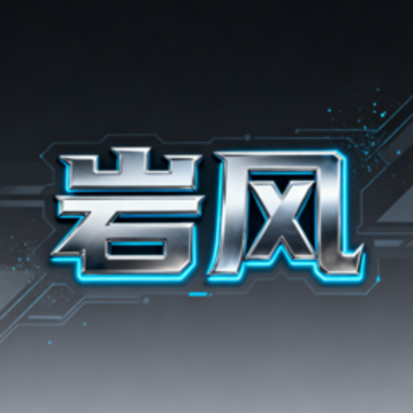

# 🎨 HACS 集成图标方案

## 正确的方案

对于通过 HACS 分发的集成，图标应该包含在集成包内，而不是要求用户手动上传。

## Home Assistant 集成图标的三种标准方式

### 方案1：使用 Material Design Icons (MDI) ✅ 推荐
**优点**：
- ✅ 不需要额外文件
- ✅ 自动适配主题
- ✅ 文件大小最小
- ✅ 标准化

**实现**：通过 `icons.json` 文件（你已经有了）

**当前配置**：
```json
{
  "entity": {
    "conversation": {
      "agent": {
        "default": "mdi:robot"
      }
    }
  }
}
```

**可以改为更合适的图标**：
```json
{
  "entity": {
    "conversation": {
      "agent": {
        "default": "mdi:robot-outline"
      }
    },
    "ai_task": {
      "default": "mdi:brain"
    }
  }
}
```

### 方案2：集成 logo（品牌图标）✅ 适合品牌展示
**文件位置**：
```
custom_components/yanfeng_ai_task/
├── icon.png          # 集成在 HACS 中显示的图标
├── icon@2x.png       # 高分辨率版本（可选）
└── logo.png          # 品牌 logo（可选）
```

**使用场景**：
- `icon.png`: HACS 商店中显示
- `logo.png`: 文档和 README 中显示

**规格**：
- 格式：PNG
- 尺寸：256x256（icon）或 512x512（logo）
- 背景：透明

### 方案3：自定义品牌图标（最复杂）⚠️
通过 `manifest.json` 引用自定义图标，但这需要更复杂的设置，不推荐用于 HACS。

## 🎯 推荐方案：组合使用

### 步骤1：添加 HACS 商店图标（可选）
```bash
# 保存你的 logo 为 icon.png
/custom_components/yanfeng_ai_task/icon.png  # 256x256
```

### 步骤2：优化 icons.json（推荐）
使用更合适的 MDI 图标：

```json
{
  "entity": {
    "conversation": {
      "agent": {
        "default": "mdi:brain"
      }
    }
  },
  "entity_component": {
    "_": {
      "default": "mdi:robot-outline"
    }
  }
}
```

**推荐的 MDI 图标**：
- `mdi:brain` - 大脑（AI 思考）
- `mdi:robot` - 机器人
- `mdi:robot-outline` - 机器人轮廓
- `mdi:head-lightbulb` - 灵感
- `mdi:chip` - 芯片
- `mdi:memory` - 内存/AI
- `mdi:android` - Android 机器人
- `mdi:robot-excited` - 兴奋的机器人

## 💡 最佳实践：为你的"岩风"品牌

由于你有自定义的科技感 logo，建议：

### 选项A：保持 MDI + 添加品牌文件
```
custom_components/yanfeng_ai_task/
├── icon.png          # 简化版 logo（用于 HACS）
├── logo.png          # 完整 logo（用于 README）
├── icons.json        # 使用 mdi:brain 或其他图标
└── README.md         # 展示你的 logo
```

**icons.json**：
```json
{
  "entity": {
    "conversation": {
      "agent": {
        "default": "mdi:brain"
      }
    }
  }
}
```

**README.md** 中展示品牌：
```markdown
<p align="center">
  
</p>

# Yanfeng AI Task

基于 ModelScope 的 Home Assistant AI 集成...
```

### 选项B：创建简化的图标版本
将你的"岩风"logo 简化为 256x256 的单色或双色图标：
- 保留核心形状
- 简化细节
- 适合小尺寸显示

## 📋 实施步骤

### 1. 创建/优化图标文件

你需要准备：
1. **icon.png** (256x256) - HACS 商店显示
2. **logo.png** (512x512 或更大) - README 展示

### 2. 放置文件
```bash
# 将文件放在项目根目录
/custom_components/yanfeng_ai_task/icon.png
/custom_components/yanfeng_ai_task/logo.png
```

### 3. 更新 icons.json（如果需要）
选择更合适的 MDI 图标

### 4. 更新 README.md
添加 logo 展示

## 🔍 关键区别

| 项目 | icon.png | logo.png | icons.json |
|------|----------|----------|------------|
| 用途 | HACS 商店 | 文档展示 | 实体图标 |
| 尺寸 | 256x256 | 512x512+ | N/A |
| 显示位置 | HACS 列表 | GitHub/README | HA 界面实体 |
| 必需性 | 可选 | 可选 | 推荐 |

## ✨ 我的建议

对于你的项目，我建议：

1. **保持使用 MDI 图标**（icons.json）
   - 选择 `mdi:brain` 或 `mdi:robot-outline`
   - 这样实体图标能正常显示

2. **添加 icon.png 到项目**
   - 简化版的"岩风"logo
   - 用于 HACS 商店展示

3. **添加 logo.png 到项目**
   - 完整的高分辨率 logo
   - 用于 README 和文档

4. **在 README 中展示品牌**
   - 用户看到文档时能看到你的品牌 logo

这样：
- ✅ 用户通过 HACS 安装后，实体有图标（MDI）
- ✅ HACS 商店中显示你的品牌图标
- ✅ README 中展示完整的品牌形象
- ✅ 不需要用户手动上传任何文件

## 🎬 下一步

如果你同意这个方案，我可以帮你：
1. 更新 icons.json 选择更好的图标
2. 创建 README.md 模板
3. 说明如何准备 icon.png 和 logo.png

需要我继续吗？
